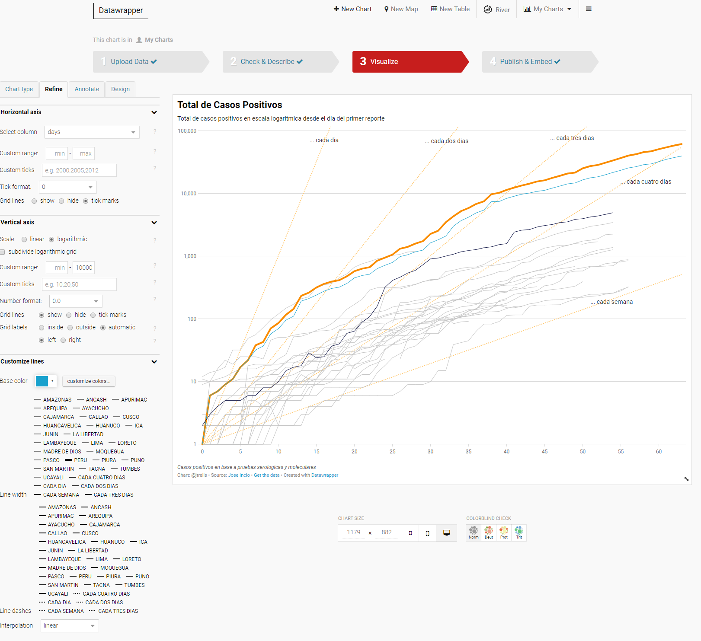

# COVID Playground 

## Altair Sample
Check *Total Cases and DataWrapper* notebook for example.

## Using DataWrapper
Using the data from MINSA, we can create an interactive chart like the following: https://datawrapper.dwcdn.net/dq19E/1/

The data proprocessing steps are also in the *Total Cases and DataWrapper* notebook. Once you obtain the CSV file (check data/piv_data.csv), follow these steps on [DataWrapper](https://www.datawrapper.de/).

### Upload File

### Describe the data
* Hide any undesided column

### Refine the chart
* Change vertical axis values to logarithmic
* Change line width and strokes
* Change base colors
* In *Annotate*, add the trend values

## Conda Requirements
Check *requirements.txt*